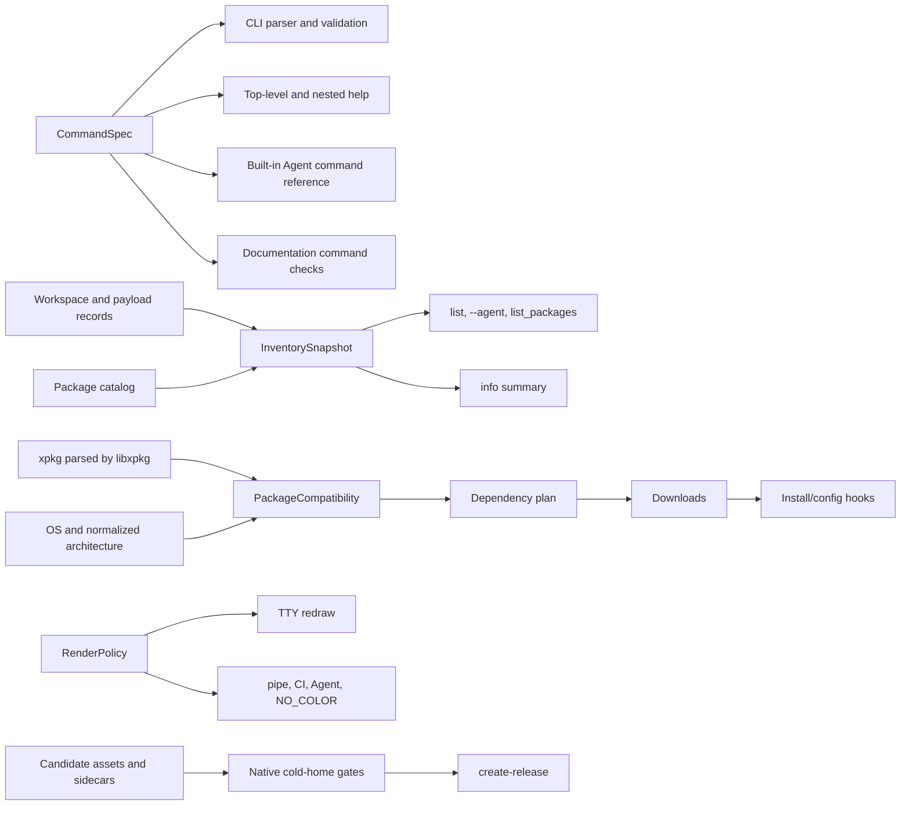

# Multiplatform user-experience contracts — design

> 2026-08-03 | status: implemented on feature branch; PR validation required

## Problem

The audit in
`.agents/docs/2026-08-03-multiplatform-user-experience-survey.md` found that
xlings already has broad release coverage, but several user-visible commands
derive their answer from the wrong source or silently discard requested work.
The result is worse than a clean failure: `list` can hide installed packages,
macOS and Windows sandbox command execution can return success without running
the command, and Linux aarch64 can accept an explicitly x86_64-only package and
turn the incompatibility into a series of HTTP 404 errors.

The same audit found four kinds of drift behind those correctness failures:

- command parsing, help, Agent guidance and documentation are authored in
  separate tables;
- package inventory is inferred from the catalog's selected version rather
  than enumerated from persisted installed versions;
- terminal rendering policy is applied to static output but not to dynamic
  progress;
- a release is published before the released artifacts have passed the same
  cold-home paths that real users run.

This change makes those contracts explicit and gives each one a single source
of truth. It is one xlings pull request. It does not merge the PR, publish a
release, change xim-pkgindex, or add xlings-res assets.

## Goals

1. Every successful command must have performed the requested action.
2. Installed inventory must enumerate exact persisted versions, including
   non-latest versions and versions removed from the current index.
3. A package with a declared incompatible architecture must be rejected before
   any download or install/config hook.
4. CLI parsing, all help levels and generated command summaries must describe
   the same command tree.
5. Non-interactive output must be stable, bounded and free of terminal control
   sequences.
6. Quick installation must honor an explicit target home and cryptographically
   bind an archive to the checksum obtained from the same release source.
7. A release must not become public until its candidate assets pass native
   cold-home verification on every published platform/architecture.
8. Public documentation must state the real isolation and artifact support
   matrix and keep executable examples aligned with the current interface.
9. An explicit cold `XLINGS_HOME` must support a first package install without
   requiring `self init`; workspace persistence creates its selected parent
   directory before writing (Issue #471).

## Non-goals

- No PR merge or release publication.
- No version bump.
- No new Linux aarch64 package payloads in `xlings-res`.
- No xim-pkgindex recipe changes. Packages such as d2x, glibc, OpenSSL, bwrap
  and proot remain unsupported on aarch64 until their repositories publish and
  declare compatible assets.
- No claim that macOS or Windows HOME redirection is a security boundary.
- No second Lua parser or URL-template expander in xlings. Parsed xpkg data
  from libxpkg remains authoritative.

## Contract architecture



The five contracts are independent at runtime but share one rule: facts are
captured once at their owning boundary, then consumed downstream. A renderer
does not guess command semantics, the catalog does not guess inventory, and a
downloader does not discover platform compatibility from a 404 response.

## 1. Exact installed inventory

### Data model

Introduce an inventory snapshot whose primary key is the canonical package
identity and exact version:

```cpp
struct InstalledPackageRecord {
    std::string canonicalName;
    std::string version;
    std::set<std::string> suboses;
    bool inCurrentSubos;
    bool payloadPresent;
    bool active;
    std::string description;
};
```

The persisted workspace `installed[]` sets and payload installation metadata
are inventory facts. The catalog is enrichment only: it may provide a
description and current aliases, but it cannot decide whether a record exists.

The collector performs these steps:

1. Read the current subos workspace for default `list`.
2. Read every real subos workspace for `list --all` and union ownership by
   canonical identity plus exact version.
3. Read payload install metadata so packages with no runnable target, legacy
   records, and versions no longer present in the current index remain visible.
4. Enrich exact versions from the catalog where possible. Missing catalog
   metadata yields an installed row with a neutral description, not deletion.
5. Mark a row active only when its release owns the currently selected target.
6. Sort by canonical name and version using the stable version comparator.

The same snapshot feeds human `list`, `--agent` output and the
`list_packages` interface capability. No renderer performs a separate search.

### Required cases

- two installed non-latest versions;
- latest installed and latest not installed;
- exact installed version absent from the index;
- workspace record whose payload is missing, visibly marked degraded;
- one payload shared by multiple suboses;
- a package that declares no program;
- namespaced packages with the same short name remain distinct.

## 2. Platform and architecture compatibility

### Rule

`package.archs` is authoritative whenever it is non-empty, for every supported
xpkg spec revision. The existing spec-2-only gate is removed. An explicit
`{"x86_64"}` declaration is never interpreted as “possibly aarch64”. This is
the safe meaning already documented by the v1 manifest specification.

Architecture aliases are normalized by libxpkg's existing normalization
helpers (`arm64`/`aarch64`, `amd64`/`x86_64`). xlings consumes the parsed field;
it does not parse Lua again.

### Placement

Compatibility is checked while resolving every root and dependency, before a
download task is created. A rejected node aborts the plan with one primary
error:

```text
E_UNSUPPORTED_TARGET: xim:d2x@2026.08.02.2 has no linux-aarch64 artifact
supported targets: linux-x86_64
```

No download, install hook, config hook or declared-program audit runs for that
node. Dependency failures name the dependency path so the requested root is
still visible.

The current installer-side check remains as a defensive invariant until every
planner entry point uses the common compatibility function. It must produce the
same error and stop the node, never continue into hooks.

Search and info remain useful for discovering cross-platform packages, but
render their target compatibility explicitly. Install is the fail-closed
boundary.

### Linux aarch64 sandbox

Because no aarch64 bwrap/proot asset is being added, automatic sandbox backend
installation fails once, before network access, with an unsupported-target
error. It does not try both resource mirrors and does not report a generic
network failure.

## 3. SubOS command execution

Extract the existing platform-specific child-shell execution into one helper
used by both normal and sandbox-level `subos use --cmd`:

```cpp
int run_shell_command(std::string_view command,
                      ShellExecutionMode mode);
```

- POSIX one-shot: `$SHELL -c <command>`.
- Windows PowerShell: `pwsh.exe -NoLogo -NonInteractive -Command <command>`,
  falling back to Windows PowerShell with the same contract.
- Windows cmd fallback: `cmd.exe /d /s /c <command>`.
- Interactive execution launches the shell without a command.
- The child inherits the already-prepared SubOS environment.
- Process creation failure is 127; otherwise the exact child exit code is
  returned.

macOS sandbox HOME redirection calls this helper after setting HOME/TMPDIR/XDG
variables. Windows calls it after setting USERPROFILE/AppData/TEMP variables.
Neither branch can ignore a non-empty command.

Native tests require a marker and exact propagation of exit code 37. An absent
marker is failure even if xlings exits zero.

## 4. Command specification and errors

### Command tree

Define a read-only `CommandSpec` tree containing:

- command and aliases;
- description and usage;
- positional arguments;
- options, aliases, value names and conflicts;
- nested subcommands;
- visibility for human help, Agent reference and completion.

The tree includes every current top-level command: install, remove, update,
search, list, info, use, config, subos, self, script, interface, agent and
profile. It includes nested `subos` and `self` commands and all their options.

Standard cmdline commands are built from the same option/argument definitions.
Handlers that remain manually positional (`subos`, `self`, `profile`, `agent`)
use shared lookup and unknown-option validation from the tree. Action callbacks
remain normal C++ functions; the spec describes syntax, not business logic.

Help rendering accepts a path such as `subos/use` and renders that exact node.
At narrow widths, usage wraps on token boundaries and remains copyable; syntax
is never truncated.

The built-in Agent usage reference consumes generated command-summary data.
A deterministic JSON form of the command tree is available to documentation
checks and future completion generators. Any existing completion consumer uses
that form rather than another handwritten command list.

### Error contract

All parser and business failures follow one output contract:

- non-zero exit status;
- diagnostics on stderr;
- stable `Error:` and optional `Hint:` labels for human output;
- stable `E_*` code in structured events;
- no full help page for an unknown command unless the user requested help;
- the first causal failure suppresses derived hook/registration errors.

`self doctor --bogus`, missing option values, surplus positionals and unknown
nested commands therefore fail consistently.

## 5. Information presentation

### Version ordering

Add a stable version-string comparator that handles an arbitrary number of
numeric components. It orders date versions such as `2026.8.3.10` numerically
without changing range semantics for the existing three-component semver
parser. Non-version strings are ordered deterministically after versions.

Internal resource keys such as `res_versioned` are never treated as versions.
Aliases are rendered separately.

### `info` semantics

Package-level and selected-version state are distinct:

- `package installed`: whether any exact version is installed;
- `selected version`: the version resolved from the query;
- `selected installed`: whether that exact version is installed;
- `active`: active installed version, when any.

Default human output includes aliases, the selected/latest version, active and
installed versions, plus a bounded recent-version summary. `--all-versions`
shows the full stable list. Structured output retains the complete machine-
readable set without forcing one multi-kilobyte display line.

Multi-value fields use semantic line breaks before layout. Non-TTY rendering
therefore remains readable even when no terminal width is known.

## 6. Rendering policy

Introduce one rendering decision at CLI startup:

```cpp
struct RenderPolicy {
    bool interactive;
    bool color;
    bool rewrite;
    bool agent;
};
```

`rewrite` is true only for a real output terminal in human CLI mode when color
is not disabled. `--agent`, redirected output and `NO_COLOR` all force static
mode.

Interactive progress may redraw every 200 ms and use erase/cursor sequences.
Static progress:

- never emits ESC, NUL, cursor movement or carriage-return animation;
- emits at most one line on a phase transition and one final result per task;
- does not print repeated unchanged zero-percent frames;
- keeps stdout for requested data and stderr for diagnostics.

`render_download_progress` receives rewrite policy explicitly and appends erase
sequences only when rewrite is true. The downloader does not start the 200 ms
render loop in static mode.

## 7. Quick installer integrity and target selection

Both POSIX and PowerShell installers use the same conceptual candidate:

```text
source + release tag + target + archive URL + checksum URL
```

The archive and `.sha256` must come from that candidate's source and tag. A
fallback retries the pair at the next source; it never combines one source's
archive with another source's checksum.

After download:

1. parse a strict SHA256 sidecar;
2. compute the archive SHA256 using an available native implementation;
3. compare case-insensitively;
4. only then inspect archive magic and extract;
5. fail closed when the checksum is absent, malformed or mismatched.

There is no silent checksum-skip mode.

An explicitly set `XLINGS_HOME` is always the installation target, including
when it does not exist yet. PATH discovery is used only when no explicit target
was supplied.

Before probing release sources, the installer checks the published target
matrix:

| OS | Architecture | Supported |
| --- | --- | --- |
| Linux | x86_64 | yes |
| Linux | aarch64 | yes |
| macOS | arm64 | yes, minimum macOS 14 |
| macOS | x86_64 | no release asset |
| Windows | x86_64 | yes |
| Windows | arm64 | no release asset |

Unsupported targets get one direct error rather than two “source unavailable”
warnings. POSIX latest selection compares all four numeric date-version
components. Completion output names the profile file actually changed, or asks
the user to restart the shell without claiming `.bashrc` was used.

Installer logging honors TTY and `NO_COLOR`; curl uses silent/show-error mode
for redirected output.

## 8. Release candidate gate

The release workflow becomes build, verify, then publish:

1. Build the four release archives.
2. Generate their SHA256 sidecars before validation.
3. Upload candidate artifacts within the workflow run.
4. Run candidate cold-home jobs on:
   - Ubuntu 24.04 x86_64;
   - native Ubuntu 24.04 aarch64;
   - macOS 14 arm64;
   - Windows x86_64.
5. Each job installs from its candidate archive/checksum, then runs the core
   lifecycle and platform SubOS command probes.
6. `create-release` needs every candidate job, not only build jobs.
7. Index publication, mirror operations and index-bump PR creation remain
   downstream of `create-release`.

The candidate bootstrap path is deterministic and reusable by normal PR CI; it
does not require a public tag. Public floating-latest fresh-install remains as
a scheduled and post-release monitor, not as the first gate.

macOS and Windows quick-install checks are no longer `continue-on-error`.
Network-independent candidate tests cover the working-tree installer and
artifact; floating public tests separately detect ecosystem drift.

The aarch64 PR/release job must run the actual binary natively and cover:

- quick/candidate install into a cold home;
- install and run of an architecture-compatible package;
- fail-closed install of an x86_64-only package with zero download attempts;
- explicit unsupported result for automatic sandbox backend provisioning.

No release is created while one of these checks is red.

## 9. Documentation and generated checks

Update README, README.zh, the quick-start documents, the SubOS design page and
the built-in/user-facing usage skills to publish the same OS/architecture and
isolation matrix:

- Linux sandbox: bwrap/proot filesystem view; bwrap required for image/tmpfs.
- macOS sandbox flag: HOME/TMPDIR/XDG redirection only.
- Windows sandbox flag: USERPROFILE/AppData/TEMP redirection only.
- macOS/Windows redirection is not suitable for genuinely untrusted code.

Replace `subos create`/`subos enter` with `subos new`/`subos use`. Replace old
stdin request examples with current `xlings interface <capability> --args ...`
invocations; stdin remains control input only. Remove stale product-version
labels where they imply current behavior is tied to 0.4.36.

Add two executable checks:

1. command examples are extracted from opted-in fenced blocks and run through
   current parser/help validation without destructive side effects;
2. interface examples are executed against the current NDJSON schema and must
   produce a valid terminal event.

Generated command-reference sections are regenerated from `CommandSpec`; CI
fails when checked-in output differs.

## 10. Verification strategy

Implementation follows test-driven development. Every behavior test is first
run against the unmodified release/current main and must fail for the intended
reason.

### Unit and local integration

- inventory collector exact-version and missing-catalog cases;
- arbitrary-component version ordering and sentinel filtering;
- architecture normalization and root/dependency refusal;
- command-tree lookup, aliases, conflicts and nested help snapshots;
- progress renderer byte contract;
- POSIX and PowerShell installer candidate/checksum behavior;
- workflow/resource contract tests proving publish depends on candidate gates;
- documentation command and NDJSON example validation.

### E2E

- isolated HOME/XLINGS_HOME inventory lifecycle;
- exact marker and exit-37 SubOS commands;
- unsupported aarch64 fixture causes zero HTTP requests and no hooks;
- static install output contains zero ESC and zero NUL and is bounded;
- explicit nonexistent `XLINGS_HOME` wins over a PATH installation;
- corrupt/missing checksum prevents extraction and execution;
- all help paths and unknown-option channels;
- info summary and `--all-versions` behavior.

### Platform CI

All existing required pull-request checks must reach a terminal success state:
Linux, Linux E2E/root/Arch Linux, native aarch64, macOS and Windows. Candidate
artifact verification added by this change is required as well. A running,
canceled, skipped-required or superseded check is not success.

## 11. Requirement-to-evidence matrix

| Audit item | Implementation authority | Completion evidence |
| --- | --- | --- |
| P0-1 list inventory | InventorySnapshot | exact-version E2E + four-platform fresh core |
| P0-2 sandbox command | shared shell executor | native marker + exit 37 |
| P0-3 architecture | compatibility gate | aarch64 zero-download refusal |
| P1-1 help drift | CommandSpec | complete nested help snapshots |
| P1-2 progress | RenderPolicy | byte tests on redirected install |
| P1-3 release window | candidate gate | workflow dependency contract + native candidate jobs |
| P1-4 installer | bound archive/checksum candidate | dual-source, explicit-home and checksum tests |
| P1-5 isolation claim | capability matrix | README/help/skill generated consistency |
| P2-1 info | inventory + version comparator | stable snapshot, no sentinel, bounded output |
| P2-2 errors | EventStream error adapter | stderr/exit/code tests |
| P2-3 stale docs | executable examples | parser and NDJSON smoke |
| P2-4 arch matrix | shared capability data | docs + early installer target rejection |
| P2-5 four-part sort | installer version comparator | `.9` versus `.10` test |

## Trade-offs

### Enforce v1 `archs` declarations

Some old recipes may have under-declared architecture support while an
aarch64 resource happens to exist. Continuing to guess preserves silent wrong-
architecture installs and 404 cascades. The safer contract is to trust explicit
metadata and require the recipe owner to correct it. Empty `archs` remains the
legacy “not declared” case.

### One large PR

The command, inventory, output and release contracts could be separate PRs.
The requested delivery is one PR, so implementation is divided into small
reviewable commits and independently testable tasks while the branch remains a
single integration unit.

### Candidate validation without publication

Testing an unpublished artifact cannot exercise GitHub release metadata or the
global mirrors. Candidate gates therefore prove archive integrity, installer
logic, cold-home lifecycle and native execution using workflow artifacts. The
existing post-release floating-latest suite remains responsible for public
metadata, mirrors and index drift.

## Revisit later

- Add native macOS x86_64 or Windows arm64 only when release assets exist.
- Convert more business handlers to declarative argument binding once the
  CommandSpec boundary is stable.
- Move package target compatibility into a future libxpkg API if multiple
  clients need identical policy; xlings must continue consuming parsed data,
  not duplicate parsing.
- Promote aarch64 bwrap/proot support only after recipes and release assets
  provide a real native backend.
