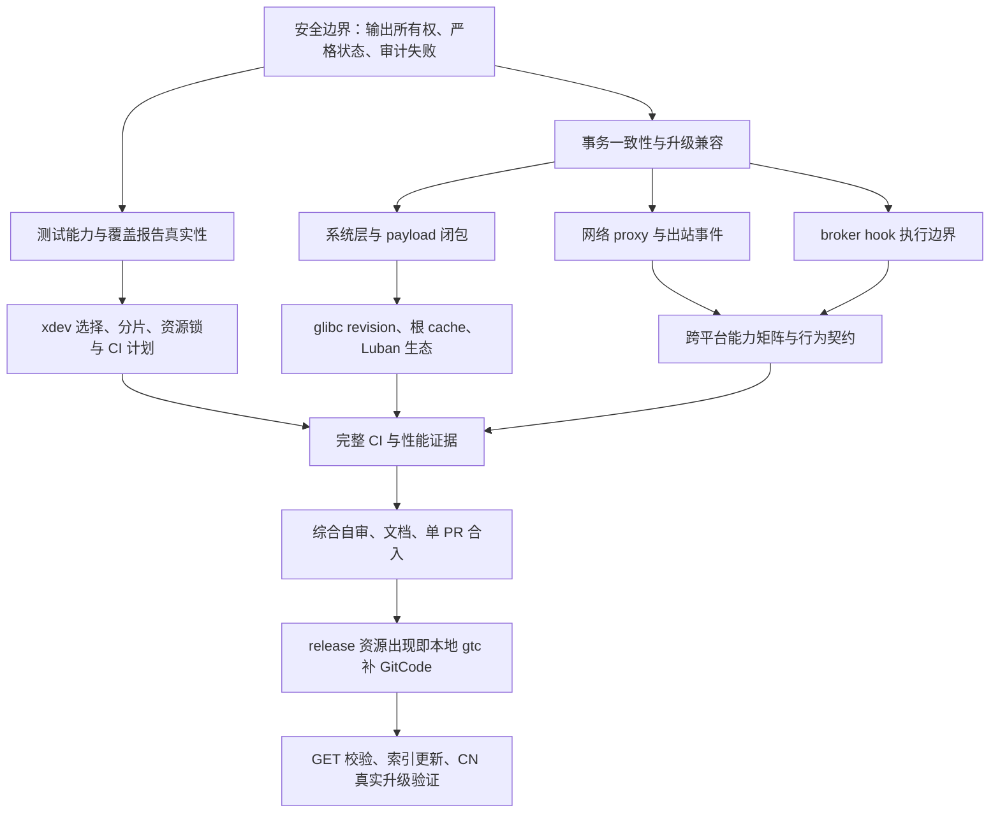

# PR #641 完整交付续行计划

日期：2026-10-08。关联：#640、#641。基线：main `c55d89a`，本地 rebase 后 `a8c2aba`。

设计输入为 2026-10-05 总体设计及 2026-10-06 Part 2。此前实施记录中的
“推迟”只描述当时的实现，不能作为本次完整交付的验收结论。已完成的实现保留，
缺项逐项记录；没有证据的能力不报告为完成。所有客户端改动继续进入 #641。
协作最多同时运行两个子 agent；构建由主 agent 串行执行，避免共享 target 冲突。

## 依赖关系

## 任务与验收

| 阶段 | 工作及依赖 | 验收证据 |
|---|---|---|
| A1 稳定性 / 用户数据 | pack/export 不清理既有输出；专属 staging；generation 输入路径与清理所有权；修复 macOS 指针读取测试 | 已有文件字节不变、失败无残留、lint、Linux/macOS/Windows 测试 |
| A2 兼容性 / 无感升级 | 缺失旧元数据允许默认；损坏/不可读文件拒绝；boot 写入保留未知字段；未知 layout 只读；stage-0 不以默认掩盖坏状态 | 旧布局、新增未知键、错误类型、坏 JSON、不可读输入的回归 |
| A3 审计 / 隐私 | journal 真实返回写入结果；locked 启动拒绝/运行终止；exec 通知先审计后放行；默认不记录参数值 | 实际不可写路径、秘密参数、两阶段通知、跨平台 stubs |
| B 一致性 | root projection 失败传播到 install/use/remove/self init；拒绝成功报告；确定失败后的可恢复状态；policy min_client 与 doctor | 命令退出码及磁盘状态、重试修复、N-1 客户端验证 |
| C 验证真实性 | 区分声明覆盖、执行通过、跳过、隔离证明；rootfs 不再声称未实现；WSL 必须真实运行才报告通过；测试不受 TERM/mirror 污染 | 单一报告显式列出缺证据项；声明能力缺失导致失败 |
| D 架构 / 跨仓库 | fetch=layer 与系统层版本解析；root store 仅绑定依赖闭包；prefix domain 构建契约；libxpkg hook sandbox 接口 | 两个用户不复制系统 payload；依赖闭包与越权探针；旧 recipe 兼容 |
| E 网络 | net=proxy 的 netns 单出口与 supervisor 桥接；DNS 代理；nat/proxy 每连接 net 事件 | 直连/DNS 旁路拒绝、代理故障拒绝、主机回环授权、真实隔离 CI |
| F 执行边界 | broker hook 在受限执行环境；保留 tty/日志契约与每 scope configure 语义 | 恶意 fixture 写其他 scope 失败、正常生态 recipe 成功 |
| G 工具 / 简洁 | xdev ci plan、area/tag/changed/shard/lane、资源锁、fixture HTTP 镜像；lint/release 包装；统一 CI 报告 | 同一选择逻辑服务本地与 CI；PR 核心测试不依赖公网；关键路径计时 |
| H Luban / 库 | glibc sysconfdir 与独立 ld.so.cache；recipe revision；资源 SHA 与两架构；编译器默认库路径 | 外来程序与根内新编译程序无额外 rpath 运行；tiny/core/desktop、boot/rollback |
| I 跨平台 / UX | 统一命令/退出码/事件；NDJSON 流；平台 unsupported 原因准确；升级与旧 policy 兼容 | Linux/macOS/Windows/aarch64、WSL、agent 无输入扫描、文档生成一致 |
| J CI / 自审 | 必需车道全部绿；审查 git diff、状态/权限/清理边界及生态兼容；补足性能预算 | 固定 head 的 CI 结果、需求与证据清单、自审报告 |
| K 发布 / 生态 | 按当天现有 release 选 N≥1；资源出现立即本地 gtc；GET/sha256；xim-pkgindex latest 与所有平台更新；设置 CN 实测 | 四平台资源、GitCode 校验、索引 CI、fresh install/self update/mcpp/SubOS |

## 跨仓库协作约束

xlings、libxpkg、xim-pkgindex、资源仓库分别使用独立分支/工作树，保留原工作树的
用户改动。先实现并验证库接口，再更新客户端依赖和索引 revision；资源发布前不
把未出现的 URL/hash 写成可安装的 latest。客户端仍以 #641 交付，上游改动记录
关联 PR/commit 与兼容测试，避免在客户端复制 Lua 解析或 URL 展开逻辑。

## 当前证据

初次 rebase 无冲突。原 PR 的 Linux lint 与 macOS generation 测试失败；本地清理
测试环境后 77 个测试程序通过，但真实沙箱等 36 个 XTEST 跳过。因此尚不能发布。
详细现场见 `.agents/docs/2026-10-08-pr-641-progress-report.md`。

本计划推进实现与有限、针对性的验证：每个修复先复现再回归，稳定批次只做一次
完整本地运行后提交 CI；新的失败或新的代码变化才触发追加检查。
