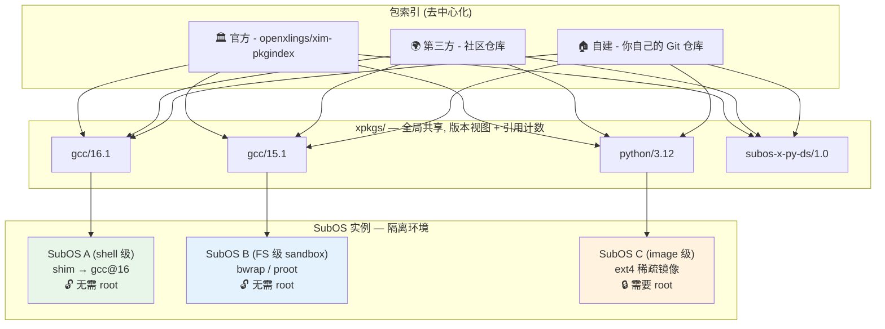
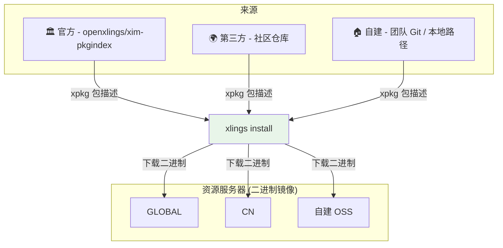

<div align=center>
  

  <h1>xlings</h1>

  <em>通用包管理基础设施 + OS-like SubOS 隔离<br/>
  多版本共存 · 无需 Root · 去中心化索引 · 面向 Agent</em>

  <b> [官网] | [文档] | [包索引] | [社区论坛] </b>

  中文 | [English](README.md)
</div>

[官网]: https://openxlings.github.io/
[文档]: docs/
[包索引]: https://openxlings.github.io/xim-pkgindex
[社区论坛]: https://forum.d2learn.org/category/9/xlings

<p align=center>
  <em>使用者: <a href="https://github.com/mcpp-community/mcpp">MCPP</a> · 即将推出的 <b>Luban</b> Linux</em>
</p>

<!-- TODO: 30s 演示 GIF -->

---

## 为什么选 xlings?

| 痛点 | 没有 xlings | 有 xlings |
|------|-------------|-----------|
| 系统 gcc@11,还想装 gcc@16 | 手动编译,容易冲突 | `xlings install gcc@16` — 两版本共存 |
| 团队需要一致的项目环境 | "在我机器上能跑" | `.xlings.json` + `xlings install` — 进入项目目录即无感进入隔离的项目级 SubOS |
| Agent 需要自己的隔离世界来运行 | Docker daemon + 镜像 + 清理 | Agent 跑在 SubOS **里面** — 拥有完全权限,无需 root,轻量级,宿主机不受影响 |

### vs 其它工具

| | apt / brew | nix | docker | **xlings** |
|---|:---:|:---:|:---:|:---:|
| 多版本共存 | ❌ | ✅ | ✅ | ✅ |
| 无需 Root | ❌ | ⚠️ | ⚠️ | ✅(image 模式除外)|
| 无 daemon | ✅ | ✅ | ❌ | ✅ |
| 跨平台统一命令 | ❌ | ⚠️ | ✅ | ✅ Linux / macOS / Windows |
| 隔离粒度 | ❌ | FS | FS+ | 🔒 shell / FS / image 三级 |
| 存储复用 | — | ✅ store | ❌ 镜像膨胀 | ✅ 版本视图 + 引用计数 |
| 启动开销 | ⚡ 即时 | ⚡ 即时 | 🐢 秒级 | ⚡ 即时 / ~10ms(sandbox)|
| 去中心化索引 | ❌ | ❌ | ❌ | ✅ 官方 + 第三方 + 自建 |
| Agent / JSON 接口 | ❌ | ❌ | ⚠️ API | ✅ `xlings interface`(NDJSON)|
| 可作 OS 级包管理器 | apt 本身是 | NixOS | ❌ | ✅(Luban Linux,即将推出)|

---

## 快速开始

### 安装

**Linux / macOS**

```bash
curl -fsSL https://raw.githubusercontent.com/openxlings/xlings/main/tools/other/quick_install.sh | bash
```

**Windows (PowerShell)**

```powershell
irm https://raw.githubusercontent.com/openxlings/xlings/main/tools/other/quick_install.ps1 | iex
```

### 让你的 AI Agent 帮你装

把以下内容复制给你的 AI agent(Claude / Codex / OpenCode 等):

```
帮我安装 xlings 包管理器。
- Linux/macOS: curl -fsSL https://raw.githubusercontent.com/openxlings/xlings/main/tools/other/quick_install.sh | bash
- Windows: irm https://raw.githubusercontent.com/openxlings/xlings/main/tools/other/quick_install.ps1 | iex
项目地址: https://github.com/openxlings/xlings
```

### 试一试多版本

```bash
xlings install gcc@16 node@24 cmake
xlings use gcc@16        # 切换当前版本
gcc --version            # gcc 16.x
```

---

## 核心概念



### 五大支柱

1. **📦 通用包管理基础设施** — binary / script / config / subos / tutorial 统统是 xpkg
2. **🔀 多版本共存** — 同一工具 N 个版本并存;版本视图 + 引用计数(N 个环境 ≈ 1 份存储)
3. **🏗️ 三级 SubOS 隔离** — shell(env 切换)/ FS(bwrap/proot,无需 root)/ image(ext4,需 root)
4. **🌐 去中心化包索引** — 官方 + 第三方 + 自建仓库;资源服务器做二进制镜像分发
5. **🤖 JSON 事件接口** — `xlings interface`(NDJSON 协议)面向 AI Agent、CI 和第三方工具

---

## 三大场景

### 🛠 工具链 — 多版本免 sudo

```bash
xlings install gcc@16 gcc@11 cmake node@24
xlings use gcc@16        # 即时切换
xlings use gcc@11        # 切回 11, 互不干扰
```

### 📦 项目 — 无感进入项目级 SubOS

当你进入包含 `.xlings.json` 的项目目录时,xlings **自动透明地激活项目级 SubOS** — 你和团队在隔离环境中工作而无需任何手动操作。所有依赖都在项目自己的 SubOS 中。

```json
{
  "workspace": {
    "xmake": "3.0.7",
    "gcc": { "linux": "16.1.0" },
    "llvm": { "macosx": "20.1.7" }
  }
}
```

```bash
cd my-project/           # 自动进入项目 SubOS
xlings install           # 依赖装进项目级隔离环境
xmake build              # 一切正常运作, 与宿主机隔离
```

clone → `cd` → build。团队和 CI 环境完全一致,无需手动激活。

### 🤖 Agent — Agent 运行在自己的轻量级世界中

xlings 让你把 agent(codex / claude / opencode 等)**运行在 SubOS 内部** — agent 在隔离环境中拥有完全权限,宿主机完全安全。

**为什么这很重要:**

- 🔓 Agent 在 SubOS 内拥有更大权限 — 装包、改文件、跑任意代码 — 不会伤害宿主机
- 🔁 同一个 agent 工具,一台机器上多个实例 — 每个 SubOS 有独立配置(正常情况下 codex/claude 一个账号只能跑一份)
- ⚡ 轻量级 — 不是重型 VM 或容器,仅 namespace 隔离

**在 SubOS 中运行 Agent:**

```bash
# 创建 SubOS(从 base 环境 fork,或自己从零配置)
xlings subos new claude-workspace --from subos:dev-env@latest

# 进入 SubOS — Agent 在这里面运行,拥有完全控制权
xlings subos use claude-workspace --sandbox
# → 现在你在 agent 的世界里
# → 在这里启动 claude / codex / opencode
# → 它们可以自由安装、修改、实验 — 宿主机不受影响

# 同一台机器上运行多个隔离的 agent 实例
xlings subos new claude-workspace-1 --from subos:dev-env@latest
xlings subos new claude-workspace-2 --from subos:dev-env@latest
xlings subos new codex-workspace --from subos:dev-env@latest
```

**一次性任务也可以用 `--cmd`:**

```bash
xlings subos use claude-workspace --sandbox --cmd "python analyze.py"
```

无需 root,无 daemon,无镜像膨胀。**每个 Agent 拥有自己的世界。**

---

## SubOS 详解

### 三级隔离

| 级别 | 机制 | 需要 Root? | 隔离范围 | 适用场景 |
|------|------|:---:|---|---|
| 🟢 **Shell** | env/PATH 切换 | 否 | 工具版本 | 日常开发, 版本锁定 |
| 🔵 **FS** | bwrap / proot 沙箱 | 否 | 文件系统(HOME, /tmp 私有) | Agent, 实验, 不受信代码 |
| 🟠 **Image** | ext4 稀疏镜像挂载 | 是 | 完整块设备隔离 | 重型工作负载, 持久化沙箱 |

### 关键能力

- **从 base fork** — `xlings subos new <name> --from <local|subos:pkg@ver>`(shared storage 下 0s)
- **非交互执行** — `xlings subos use <name> --cmd "<command>"`(exit code 透传)
- **沙箱模式** — `--sandbox` 标志;bwrap 优先(setuid,xim 自管理),proot 兜底
- **存储模式** — `--storage shared|tmpfs|image`,fork 时选择
- **项目级 SubOS** — `.xlings.json` 中声明,进入项目目录即自动透明激活
- **Keeper(可选)** — `--keep` 保持 mount namespace 活跃,高频 exec 优化;`xlings subos stop` 释放

---

## 包索引生态



一行添加自定义索引:

```json
{
  "index_repos": [
    { "name": "xim", "url": "https://github.com/openxlings/xim-pkgindex.git" },
    { "name": "my-team", "url": "git@gitlab.internal:devtools/pkgs.git" }
  ]
}
```

---

## 生态

| 项目 | 角色 | 链接 |
|------|------|------|
| **MCPP** | 现代 C++ 构建工具生态 — 通过 xlings 分发 | [github.com/mcpp-community/mcpp](https://github.com/mcpp-community/mcpp) |
| **Luban Linux** | 即将推出的 Linux 发行版,采用 xlings 作为系统级包管理器 | *(发布时更新链接)* |
| **xim-pkgindex** | 官方包索引 — 60+ 个包持续增长 | [openxlings/xim-pkgindex](https://github.com/openxlings/xim-pkgindex) |

---

## Agent 集成

### Agent 运行在 SubOS 内部

不同于传统的"agent 调用工具"模式,xlings 让 **agent 本身运行在 SubOS 里面**。agent 拥有一个完整的隔离环境 — 可以装包、写文件、跑服务 — 全都不会影响宿主机。

| 场景 | 实现方式 |
|------|---------|
| 安全地给 agent 完全权限 | agent 在 `--sandbox` SubOS 内运行 |
| 同一 agent 工具(codex/claude)一台机器多实例 | 每个实例一个 SubOS |
| Agent 需要特定环境(Python + CUDA + 自定义库) | 从 `subos:ml-env@latest` fork |
| 临时任务执行 | `--storage tmpfs` + `--cmd` |

### 程序化接口

`xlings interface` 提供 NDJSON 协议(stdio 通信)— 面向 AI Agent、CI 系统和第三方工具的程序化控制:

```bash
xlings interface
# → {"protocol":"1.0","capabilities":[...]}
# ← {"action":"install","target":"subos:py-ds@latest"}
# → {"kind":"progress","phase":"downloading","percent":45,...}
# → {"kind":"data","dataKind":"installed","payload":{...}}
```

### 开发 & 测试环境

除了 Agent,SubOS 同样适合开发和测试:

```bash
# 不同场景不同环境
xlings subos new rust-nightly --storage shared
xlings subos new legacy-gcc11 --storage shared

# 或使用项目级模式:进入项目目录即自动进入隔离环境
cd my-project/           # 无感进入项目 SubOS
```

---

## 从源码构建

```bash
# 1. 安装 xlings(见上方"快速开始")
# 2. 在仓库根目录安装构建依赖:
xlings install           # 读取 .xlings.json → xmake, cmake, ninja, 工具链

# 3. 切换到开发工具链:
xlings use gcc@16.1.0    # 确保 xrepo 缓存用 glibc 链接

# 4. 构建:
xmake f -y && xmake build xlings
xmake build xlings_tests && xmake run xlings_tests
```

`.xlings.json` 同时驱动 CI 和 release 流水线。

---

## 社区

- **论坛**: [forum.d2learn.org/category/9/xlings](https://forum.d2learn.org/category/9/xlings)
- **QQ 群**: 167535744 / 1006282943
- **Issues**: [github.com/openxlings/xlings/issues](https://github.com/openxlings/xlings/issues)

### 参与贡献

- [Issue 处理与 Bug 修复](https://xlings.d2learn.org/documents/community/contribute/issues.html)
- [添加新包](https://xlings.d2learn.org/documents/community/contribute/add-xpkg.html)
- [文档编写](https://xlings.d2learn.org/documents/community/contribute/documentation.html)

---

**贡献者**

<a href="https://github.com/openxlings/xlings/graphs/contributors">
  
</a>

[](https://star-history.com/#openxlings/xlings&openxlings/xim-pkgindex&Date)
