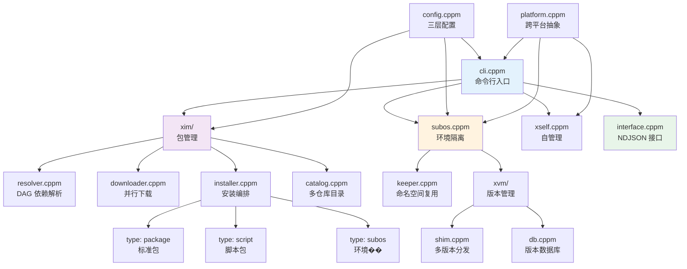
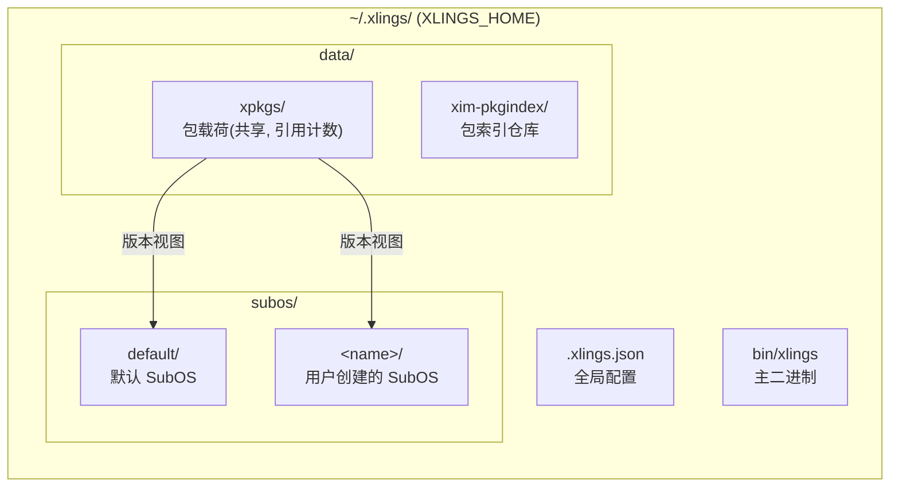
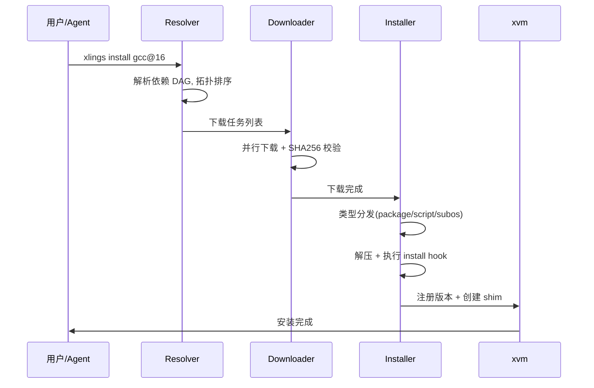
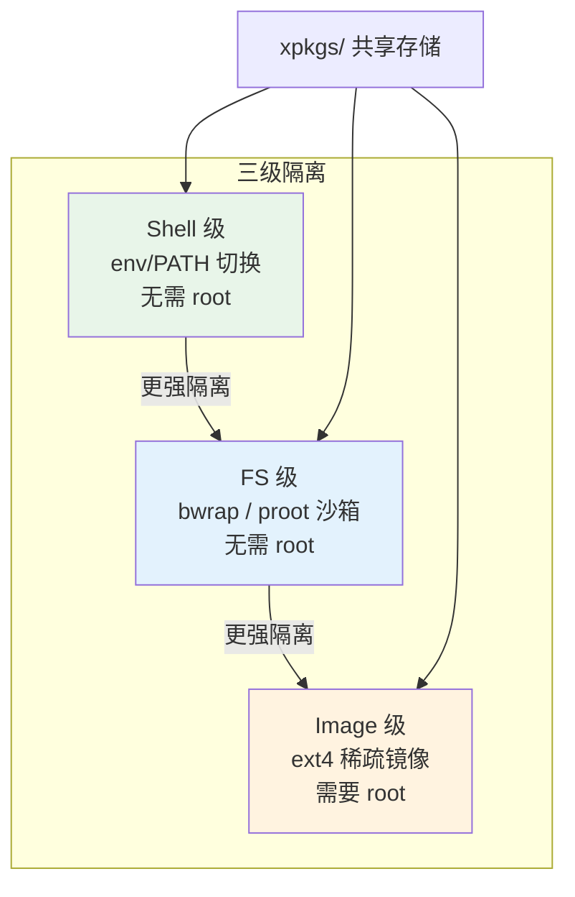

# 系统架构概览

> 编写日期: 2026-05-17 | 版本: 0.4.36

## 概述

xlings 是一个用 C++23 模块���现的单二进制包管理工具。提供多版本包管理、环境隔离(SubOS)和面向 Agent 的程序化接口。

## 模块关系

## 数据布局

每个 SubOS 通过 workspace 元数据(.xlings.json)声明���见的包版本。包载荷存储在 `xpkgs/` 中,多个 SubOS 共享同一份物理文件(版本视图 + 引用计数)。

## 包安装流程

## SubOS 隔离模型

| 级别 | 机制 | 需要 root | 隔离范围 | 适用场景 |
|------|------|:---------:|----------|----------|
| Shell | 环境变量 + PATH 操作 | 否 | 工具版本可见性 | 日常开发 |
| FS | bwrap(优先)/ proot 沙箱 | 否 | 文件系统(HOME, /tmp 私有)| Agent, 实验 |
| Image | ext4 稀疏文件 + loop 挂载 | 是 | ��设备级完整隔离 | 重型工作负载 |

三个级别共享同一个 `xpkgs/` 载荷存储。隔离通过 workspace 元数据(哪些版本可见)和文件系统命名空间(哪些路径���访问)实现。

## 核心设计原则

1. **单二进制** — 除 libc 外无运行时依赖(Linux release 使用 musl 静态链接)
2. **版本视图 + 引用计数** — N 个 SubOS 引用同一份物理包载荷,无重复���储
3. **类��驱动分发** — 包类型(package/script/subos)决定安装/配置/卸载行为
4. **去中心化索引** — 官方、第三方、自建仓库共存;资源服务器提供二进制镜像
5. **跨平台** — Linux / macOS / Windows 共用同一代码库,平台特定代码隔离在 `platform/`
