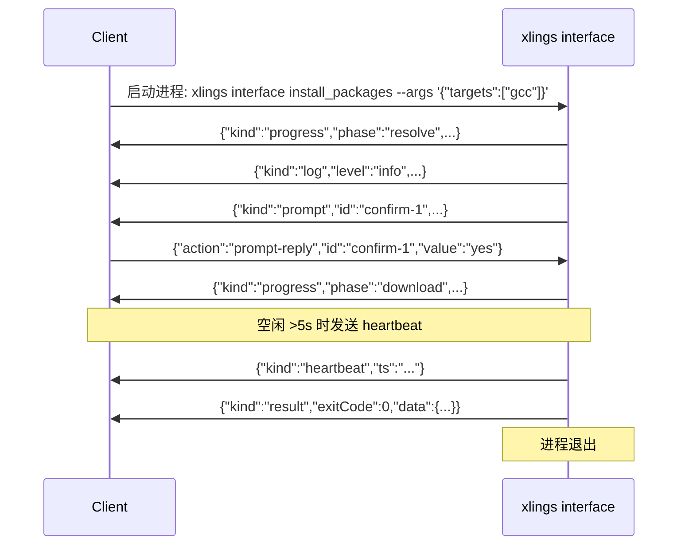

> 更新日期：2026-08-03

# Interface Protocol — NDJSON over stdio

## 概述

`xlings interface` 子命令提供面向程序的 NDJSON（换行分隔 JSON）协议，通过 stdin/stdout 与外部工具通信。适用于 AI Agent、CI 流水线、IDE 插件等需要结构化交互的场景。

协议版本: **1.0**（由 `kProtocolVersion` 常量定义）。

## 协议基础

- 每行一个完整 JSON 对象，以 `\n` 结尾。
- stdout 方向：xlings -> 客户端（事件流）。
- stdin 方向：客户端 -> xlings（控制请求）。
- 所有输出在写入后立即 flush，保证实时性。
- 空闲超过 5 秒时自动发送 `heartbeat` 事件。

### 版本握手

客户端可通过 `--version` 标志查询协议版本：

```bash
xlings interface --version
```

返回：

```json
{"protocol_version":"1.0"}
```

### 能力发现

```bash
xlings interface --list
```

返回所有已注册 capability 的名称、描述及 JSON Schema。

## 事件类型

xlings 通过 stdout 输出以下事件：

| kind | 字段 | 说明 |
|------|------|------|
| `progress` | `phase`, `percent`, `message` | 任务进度通知 |
| `log` | `level`(debug/info/warn/error), `message` | 日志消息 |
| `data` | `dataKind`, `payload` | 结构化数据（payload 为解析后的 JSON 或原始字符串） |
| `prompt` | `id`, `question`, `options`, `defaultValue` | 需要用户/客户端应答的交互提示 |
| `error` | `code`, `message`, `recoverable`, `hint`? | 错误事件 |
| `heartbeat` | `ts` | 空闲心跳（ISO 8601 时间戳） |
| `result` | `exitCode`, `data`? | 终结事件，标志调用结束 |

### 事件示例

```json
{"kind":"progress","phase":"download","percent":42,"message":"fetching gcc@16.1.0"}
{"kind":"log","level":"info","message":"resolving dependencies..."}
{"kind":"data","dataKind":"pkg-meta","payload":{"name":"gcc","version":"16.1.0"}}
{"kind":"prompt","id":"confirm-1","question":"overwrite existing?","options":["yes","no"],"defaultValue":"no"}
{"kind":"error","code":"NotFound","message":"unknown capability: foo","recoverable":false,"hint":"run `xlings interface --list`"}
{"kind":"heartbeat","ts":"2026-05-17T08:30:00Z"}
{"kind":"result","exitCode":0,"data":{"installed":true}}
```

## 请求格式（stdin）

客户端通过 stdin 发送 JSON 行来控制执行流程：

| action | 附加字段 | 说明 |
|--------|----------|------|
| `cancel` | — | 取消当前执行 |
| `pause` | — | 暂停执行 |
| `resume` | — | 恢复执行 |
| `prompt-reply` | `id`, `value` | 回复 prompt 事件 |

示例：

```json
{"action":"cancel"}
{"action":"prompt-reply","id":"confirm-1","value":"yes"}
```

无法识别的 action 会产生一条 warn 级别的 log 事件。

## 会话生命周期



## 调用方式

```bash
# 执行某个 capability，传递 JSON 参数
xlings interface install_packages --args '{"targets":["gcc@16.1.0"],"yes":true}'

# 从文件读取参数（适用于 Windows 命令行引号问题）
xlings interface install_packages --args-file /tmp/args.json
```

## 使用场景

- **AI Agent 集成**：Agent 解析 NDJSON 事件流实时获取安装/构建状态，通过 stdin 自动应答 prompt。
- **CI 自动化**：在无 TTY 环境中以结构化方式获取执行结果和错误码。
- **IDE 插件**：编辑器后台调用 `xlings interface`，将 progress 事件映射为进度条 UI。

## 设计决策：为何选择 NDJSON over stdio

| 对比维度 | NDJSON/stdio | HTTP/WebSocket |
|----------|--------------|----------------|
| 启动开销 | 零（直接管道） | 需要监听端口、握手 |
| 跨平台 | stdin/stdout 各平台一致 | 端口分配、防火墙差异 |
| 安全性 | 继承父进程权限，无网络暴露 | 需认证机制 |
| 调试体验 | `| jq` 直接可读 | 需额外抓包工具 |
| 并发模型 | 单进程单会话，简洁可靠 | 需连接管理 |

stdio 管道是 CLI 工具与外部程序交互的最自然边界——无需额外依赖，天然支持流式输出，且与 Unix 哲学一致。
