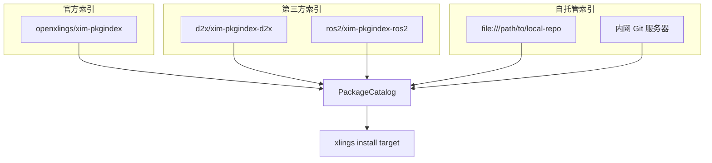
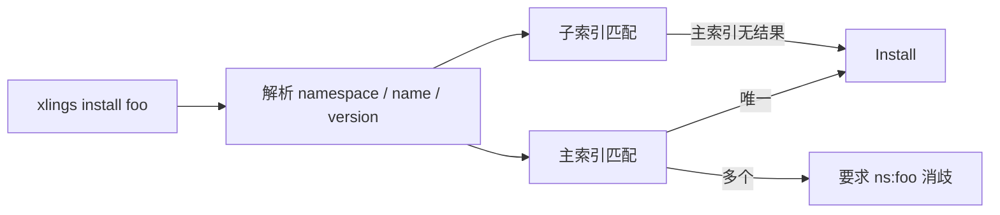

> 编写日期: 2026-05-17 | 版本: 0.4.36

# 包索引生态系统设计

## 概述

xlings 采用去中心化的包索引设计。索引仓库本身是普通 Git 仓库，任何人均可托管自己的索引，用户通过配置文件声明需要加载的索引源。系统在解析包名时自动合并多个索引，并以命名空间消歧义。

## 三层源模型



- **官方索引 (xim)**: 始终存在，由 `default_global_index_repos_` 保证即使用户添加自定义源也不会丢失。
- **第三方索引**: 通过 `xim-indexrepos.lua` 发现或用户手动配置，作为 sub-index 加入。
- **自托管索引**: 支持 `file://` 本地路径或私有 Git URL；本地路径以符号链接映射，无需克隆。

## 索引仓库格式

每个索引仓库遵循统一目录结构：

```
<repo-root>/
├── pkgs/
│   ├── p/
│   │   └── python.lua
│   ├── g/
│   │   └── gcc.lua
│   └── n/
│       └── nodejs.lua
└── xim-indexrepos.lua   (可选，声明子索引)
```

包定义文件 (`pkgs/<首字母>/<name>.lua`) 导出 `xpkg.Package` 结构，包含元数据和各平台版本矩阵。

## 多索引解析

`PackageCatalog` 加载所有配置中的索引（项目级 + 全局级），按以下优先级解析包名：

1. 项目索引 > 全局索引
2. 主索引 > 子索引 (sub-index)
3. 同名多源时要求显式命名空间: `namespace:pkgname`



解析代码位于 `catalog.cppm` 的 `collect_matches_`：对 bare name 优先返回主索引结果，仅在主索引无匹配时才降级到子索引。

## 资源服务器

资源服务器承载二进制包归档，按地域分组：

| 键        | 默认服务器                         |
|-----------|-----------------------------------|
| `GLOBAL`  | `https://github.com/xlings-res`   |
| `CN`      | `https://gitcode.com/xlings-res`  |

当同一分组存在多个候选服务器时，系统自动探测延迟 (`probe_resource_server_latency_`)，选择最快节点；若延迟 ≤ 100ms 则立即采用，避免多余探测。结果缓存于进程生命周期内。

查找顺序：项目配置 → 全局配置 → 内置默认值 → GLOBAL 兜底。

### xpkg 资源声明契约（0.4.63）

包配方保持 `xpm.<platform>.<version>` 原模型，并可用根级或平台级
`xpm.source = "xlings-res" | <URL template>` 消除重复 URL。版本项显式 `url` 覆盖
默认 source；多架构资源使用 per-arch SHA256。官方二进制的每个受支持架构都必须有
权威 hash，索引生成器缺少资产、sidecar 或 hash 时 fail closed。

旧的裸 `"XLINGS_RES"`、`res = true`、单 URL、mirror、`ref` 和单 hash 继续解析，
但新配方推荐 `source` 形式。详细字段、模板占位符和兼容优先级见
[xpkg 资源解析设计](xpkg-resource-resolution.md)。

## 配置方式

在 `.xlings.json`（全局或项目级）中声明：

```jsonc
{
  "index_repos": [
    { "name": "ros2", "url": "https://github.com/ros2/xim-pkgindex-ros2.git" }
  ],
  "XLINGS_RES": {
    "GLOBAL": ["https://github.com/xlings-res"],
    "CN": ["https://gitcode.com/xlings-res", "https://mirror.example.com/xlings-res"]
  }
}
```

- `index_repos`: 数组，每项包含 `name` 和 `url`。系统自动补齐官方索引。
- `XLINGS_RES`: 对象形式按镜像键分组；也支持字符串/数组简写作为 `DEFAULT` 键。
- 兼容旧字段: `resource_server`, `resource_servers`, `res_servers`, `xim.mirrors.res-server`。

## 同步机制

> 0.4.52+ 起,官方索引(主 + 默认子索引)默认改为**作为版本化资源工件下载**(Y-asset),
> 不再运行时 git clone;下方的 git 路径保留为兜底,以及用户自定义/本地索引的通用路径。
> 完整的演进、对比与 CN 要点见 **[index-distribution.md](./index-distribution.md)**。

`sync_repo`(git 兜底 / 自定义源路径)：

1. **首次**: `git clone --depth 1`，支持镜像 fallback（`mirror::expand` 生成候选 URL 列表）。
2. **更新**: `git pull --ff-only`；失败时 `fetch + reset --hard origin/HEAD`。
3. **节流**: 写入 `.xlings-sync-stamp` 文件，7 天内跳过非强制同步。
4. **本地索引**: `file://` 或相对路径以符号链接映射，不执行 git 操作。

工件路径(`indexfetch.cppm`):取 `*-latest.json` 指针 → sha256 校验 → 原子解压换入,
经 resource-server(延迟重排 + 卡顿看门狗)。`XLINGS_INDEX_SOURCE=git|artifact|auto` 控制。

`sync_all_repos` 按顺序:主索引(工件优先,git 兜底)→ 发现子索引 → 同步子索引(默认子索引工件优先)→ 项目索引。

## 官方索引常驻保证

`Config` 构造函数中 (config.cppm L443-459)：

```
if (globalIndexRepos_.empty()) {
    globalIndexRepos_ = default_global_index_repos_(mirror_);
} else {
    // 确保默认索引始终在列表头部
    for (auto& def : defaults) {
        if (!found) globalIndexRepos_.insert(begin, def);
    }
}
```

无论用户如何配置 `index_repos`，官方 `xim` 索引始终被插入到列表首位，保证基础包（python、gcc 等）始终可解析。
