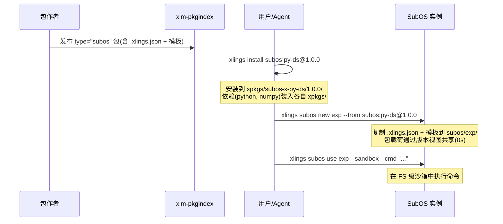

# SubOS as XPKG

> 编写日期: 2026-05-17 | 版本: 0.4.36

## 概要

SubOS 环境可以作为标准 xpkg 包进行分发。包作者声明 `type = "subos"`,用户安装后可通过 fork 机制在近零时间内创建隔离实例。

## 工作机制



## 包描述示例

```lua
package = {
    spec = "1",
    name = "py-ds",
    namespace = "subos",
    type = "subos",
    xpm = {
        linux = {
            deps = {"python@3.11", "numpy@1.26"},
            ["1.0.0"] = {
                url = "https://example.com/py-ds-1.0.0.tar.gz",
                sha256 = "...",
            }
        }
    }
}
```

tarball 内容:`.xlings.json`(workspace 声明)+ 可选模板��件��无需编写 install hook;内置的 `type = "subos"` 处理器自动处理。作者可通过定义 `install()` / `config()` / `uninstall()` 函数覆盖默认行为。

## 命令行接口

| 命令 | 作用 |
|------|------|
| `xlings install subos:<name>@<ver>` | 安装 base 包 |
| `xlings subos new <inst> --from subos:<name>@<ver>` | 从包 fork 实例 |
| `xlings subos new <inst> --from <local>` | 从本地 SubOS fork |
| `xlings subos use <inst> --cmd "<cmd>"` | 非交互执行 |
| `xlings subos use <inst> --sandbox --cmd "..."` | 沙箱内执行 |
| `xlings subos stop <inst>` | 释放 keeper |
| `xlings subos remove <inst>` | 删除实例 |

## 设计决策

| 决策项 | 选择 | 原因 |
|--------|------|------|
| 包格式 | 标准 xpkg 描述符中增加 `type = "subos"` | 复用现有安装管线,仅增加一个 type 值 |
| 安装路径 | `xpkgs/<ns>-x-<name>/<ver>/` | 与所有其它包一致,无特殊前缀 |
| xvm 注册 | 正常注册 | 保持包生命周期一致性(安装/卸载/查询) |
| Fork 机制 | 文件系统复制(支持 reflink 的文件系统上为 COW) | COW 文件系统上零成本;其它文件系统退化为完整复制 |
| 存储模式 | 由 fork 时用户选择,base 包不指定 | base 是平台无关的配方;存储模式是运行时决策 |
| 升级路径 | 显��� — 多版本在 xpkgs/ 中并存 | 避免静默替换用户已修改的环境 |

## 相关文档

- [系统架构概览](../architecture/overview.md)
- 完整设计迭代历史:`.agents/docs/subos-as-xpkg-design-2026-05-16.md`
