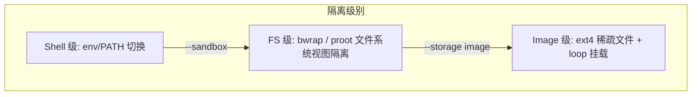
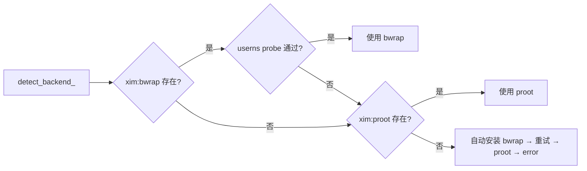

> 编写日期: 2026-05-17 | 版本: 0.4.36

# SubOS 隔离模型

## 概述

SubOS 提供三级轻量环境隔离，从零开销的环境变量切换到完整块设备隔离，按需递进。隔离级别与存储模式是正交的两个维度，可自由组合。



## 三级隔离详解

### Level 1 — Shell 级

- 入口: `xlings subos use <name>`
- 机制: 仅修改 `$PATH` 和环境变量 (`XLINGS_ACTIVE_SUBOS`)，启动子 shell
- 开销: 零额外开销，无特权要求
- 共享: 与宿主共享完整文件系统视图
- 提示符: `[xsubos:<name>]`

### Level 2 — FS 级 (Sandbox)

- 入口: `xlings subos use <name> --sandbox [bwrap|proot]`
- 机制: 通过 namespace/ptrace 构建隔离的文件系统视图
- 特点: rootless、私有 HOME 和 /tmp、真实用户身份（非 fake root）
- 提示符: `<xsubos:<name>>`

宿主只读绑定:
- `/usr`, `/bin`, `/lib`, `/lib64` — POSIX 用户态工具链
- `/etc/resolv.conf`, `/etc/ssl`, `/etc/ld.so.cache` — 网络与链接器
- `/proc`, `/sys`, `/dev` — 内核接口

沙箱读写:
- `/home/<user>` — 私有用户目录
- `/tmp` — 私有临时目录
- `~/.xlings` — 与宿主共享 (工具链/配置)

### Level 3 — Image 级

- 创建: `xlings subos create <name> --storage image`
- 机制: `truncate` 创建稀疏文件 + `mkfs.ext4` 格式化 + `sudo mount -o loop` 挂载
- 结果: `/home` 完全位于独立块设备，具备 inode/权限/quota 隔离
- 默认大小: 50G（稀疏文件，实际占用按需增长）
- 卸载: `sudo umount` 自动清理

## 后端选择策略



| 后端 | 机制 | 特权要求 | 存储模式支持 |
|------|------|----------|--------------|
| bwrap | setuid + mount namespace | xim 安装时 chmod 4755 | Shared / Tmpfs / Image |
| proot | ptrace 系统调用拦截 | 无 | 仅 Shared |

bwrap 为首选后端。系统 `/usr/bin/bwrap` 被跳过 (缺 setuid、AppArmor 限制)；仅使用 xim-pool 管理的 setuid 二进制。Image/Tmpfs 存储模式要求 bwrap (需要 mount namespace)，proot 不支持。

## 存储模式与隔离级别

两轴正交设计:

| 存储模式 | Shell 级行为 | Sandbox 级行为 |
|----------|-------------|---------------|
| **Shared** | 仅 env 切换 | 绑定 `subos/<name>/home/` 和 `tmp/` |
| **Tmpfs** | 仅 env 切换 (存储休眠) | bwrap `--tmpfs /home --tmpfs /tmp`，退出即消失 |
| **Image** | 仅 env 切换 (存储休眠) | loop mount `home.img` → 绑定到 `/home` |

Shell 级入口永远不触发挂载操作；非 Shared 存储仅在 `--sandbox` 时生效。

## 沙箱目录布局

```
~/.xlings/subos/<name>/
    bin/              # subos 专属工具链 (shim)
    home/             # Shared 模式: 沙箱用户 HOME
        <user>/
            .bashrc
            .profile
            .config/fish/config.fish
            .zshrc
            .xlings -> ~/.xlings  (宿主共享)
    tmp/              # Shared 模式: 沙箱 /tmp
    etc/              # NSS 模板 (passwd, group, hosts, nsswitch.conf)
    sandbox-root/     # proot chroot 根 (避免路径反转 bug)
    home.img          # Image 模式: ext4 稀疏文件
    .mountpoint/      # Image 模式: loop 挂载点
    .xlings.json      # subos 元数据 (storage, name, ...)
```

## 安全模型

**共享 (对外可见):**
- 宿主 `/usr`, `/bin`, `/lib*` (只读)
- `~/.xlings` 目录 (读写，工具链共享)
- `/proc`, `/sys`, `/dev`

**私有 (对外不可见):**
- `/home/<user>` — 沙箱独占
- `/tmp` — 沙箱独占
- `/etc/passwd`, `/etc/group` — 沙箱自有模板 (仅包含 root + 当前用户)
- 宿主 HOME、其他用户目录 — 不绑定

**限制:**
- 禁止嵌套沙箱 (检测 `XLINGS_SUBOS_MODE=sandbox`)
- proot 后端无法阻止 ptrace escape (安全边界为便利性隔离，非安全容器)

## 跨平台行为

| 平台 | Shell 级 | FS 级 (Sandbox) | Image 级 |
|------|----------|-----------------|----------|
| **Linux** | 完整支持 | bwrap (首选) / proot (回退) | ext4 loop mount |
| **macOS** | 完整支持 | HOME 重定向 only (无 namespace/ptrace) | 不支持 |
| **Windows** | env 切换 (CreateProcess) | 不支持 | 不支持 |

macOS 沙箱入口仅提供 HOME 重定向 (设置 `$HOME` 指向沙箱目录)，不提供文件系统视图隔离。Windows 仅支持 Shell 级环境变量切换。

## GPU 透传 (`--gpu`)

bwrap 后端默认通过 `--dev /dev` 创建全新 tmpfs，只暴露最小设备节点白名单 (`null` / `zero` / `random` / `tty` / ...)，宿主的 `/dev/nvidia*`、`/dev/dri/*` 等字符设备**完全不可见**。这是 "最小宿主暴露" 原则的体现，但同时也阻断了 sandbox 内的 GPU 使用。

需要 GPU 时显式追加 `--gpu`：

```bash
xlings subos use mygpu --sandbox --gpu
```

`--gpu` 启用后会：

- 对宿主**存在**的 NVIDIA 节点（`/dev/nvidiactl`、`/dev/nvidia-uvm`、`/dev/nvidia-uvm-tools`、`/dev/nvidia-modeset`、`/dev/nvidia0..15`）以 `--dev-bind` 透传；不存在的节点静默跳过
- 透传 `/dev/dri` (DRM / Vulkan / 显示)
- 以只读方式绑定 `/sys`（libcuda / nvml 通过 `/sys/bus/pci/devices/...` 枚举 GPU 所必需）

约束：

- `--gpu` 必须与 `--sandbox` 同时使用，否则解析期报错
- proot 后端默认即 `--bind /dev` + `--bind /sys` 全透传，`--gpu` 在 proot 模式下静默无视

实现位于 `src/core/subos/gpu.cppm`，独立于 `subos.cppm`，方便后续扩展 AMD ROCm (`/dev/kfd`) 等。设计文档：`.agents/docs/2026-05-22-subos-sandbox-gpu-passthrough.md`。
