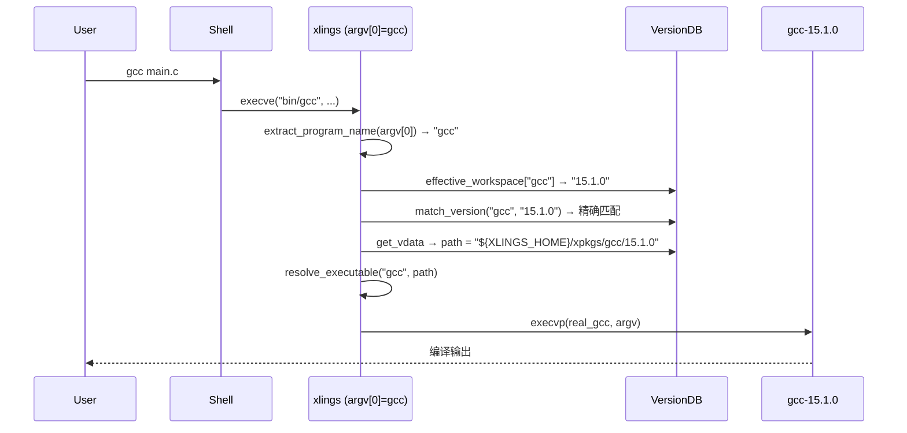
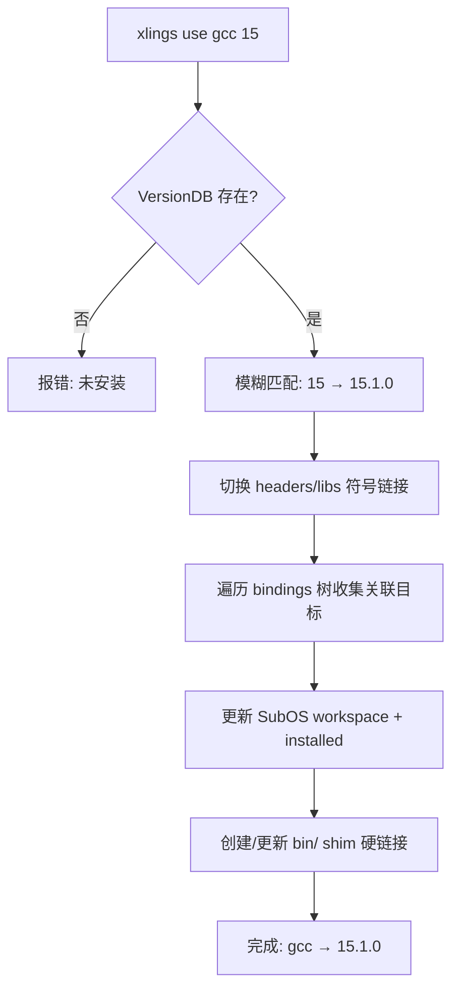

> 编写日期: 2026-05-17 | 版本: 0.4.36

# xvm: 多版本共存管理

## 概述

xvm 是 xlings 的版本管理子系统，为任意工具链提供多版本共存能力。核心设计目标：

- 单份存储：工具的每个版本在磁盘上只保存一份（`xpkgs/`）
- 多环境视图：每个 SubOS 通过 workspace 声明自己可见的版本集合
- 零开销切换：通过 multicall shim 机制，`argv[0]` 决定分发到哪个版本

## 核心数据结构

### VersionDB（全局版本注册表）

```
VersionDB = map<target, VInfo>
```

| 字段 | 类型 | 说明 |
|------|------|------|
| `VInfo.type` | string | `"program"` 或 `"lib"` |
| `VInfo.filename` | string | shim 文件名（可选覆盖） |
| `VInfo.versions` | map<ver_key, VData> | 已注册版本 → 路径等元数据 |
| `VInfo.bindings` | map<peer, map<ver,ver>> | 双向版本绑定（如 gcc ↔ g++） |

`VData` 记录每个版本的安装路径、头文件目录、库目录、别名和环境变量。

### Workspace（活跃版本映射）

```
Workspace = map<target, active_version>   // 当前激活版本
WorkspaceInstalled = map<target, vec<version>>  // 当前 SubOS 已安装版本集
```

三层优先级：**项目 > SubOS > 全局**（`Config::effective_workspace()` 按此合并）。

## Shim 分发机制

xlings 二进制本身作为所有托管工具的 shim。安装工具时在 `bin/` 下创建硬链接，文件名即工具名。运行时通过 `argv[0]` 判断调用意图。



关键细节：
- 递归防护：`XLINGS_SHIM_DEPTH` 环境变量限制最大递归深度为 8
- 别名模式：`VData.alias` 非空时走 `platform::exec` 而非 `execvp`
- 模糊匹配：输入 `"15"` 可匹配 `"15.1.0"`，命名空间前缀参与优先级排序

## 版本视图：SubOS 隔离

每个 SubOS 维护独立的 `SubosWorkspace`：

```json
{
  "gcc": { "active": "15.1.0", "installed": ["14.2.0", "15.1.0"] },
  "python": { "active": "3.12.4", "installed": ["3.12.4"] }
}
```

SubOS-A 与 SubOS-B 可以各自激活不同版本，互不干扰。shim 分发时读取当前 SubOS 的 workspace，仅从该视图中解析版本。

未安装的版本对当前 SubOS 不可见——即使全局 VersionDB 已注册。用户需显式 `xlings install` 将版本纳入当前 SubOS 视图。

## 引用计数与存储共享

```
xpkgs/
  gcc/
    14.2.0/   ← SubOS-A installed[]
    15.1.0/   ← SubOS-A, SubOS-B installed[]
  python/
    3.12.4/   ← SubOS-B installed[]
```

`xpkgs/` 是唯一存储位置。多个 SubOS 的 `installed[]` 指向同一物理路径，无需复制。`xlings use` 在新 SubOS 中激活已有版本时自动将其加入 `installed[]`（零拷贝操作）。

## `xlings use` 命令流程



步骤说明：
1. 模糊版本匹配（`match_version`）：前缀匹配 + 降序选最高
2. 头文件/库切换：移除旧版 symlink，安装新版到 `subos/usr/include`、`subos/usr/lib`
3. Binding 传播：gcc 切换时自动同步 g++ 到对应版本
4. Workspace 持久化：写入 SubOS 的 `.xlings.json`
5. Shim 同步：确保 `bin/` 下存在对应硬链接

## 存储效率

| 场景 | 传统方案 | xvm |
|------|----------|-----|
| 3 个 SubOS 各用 gcc 15.1.0 | 3 份副本 | 1 份 + 3 条 installed 记录 |
| 新 SubOS 激活已有版本 | 完整安装 | workspace 写入（毫秒级） |

**N 个环境 ≈ 1x 存储**——所有环境共享 `xpkgs/` 下的同一 payload。
