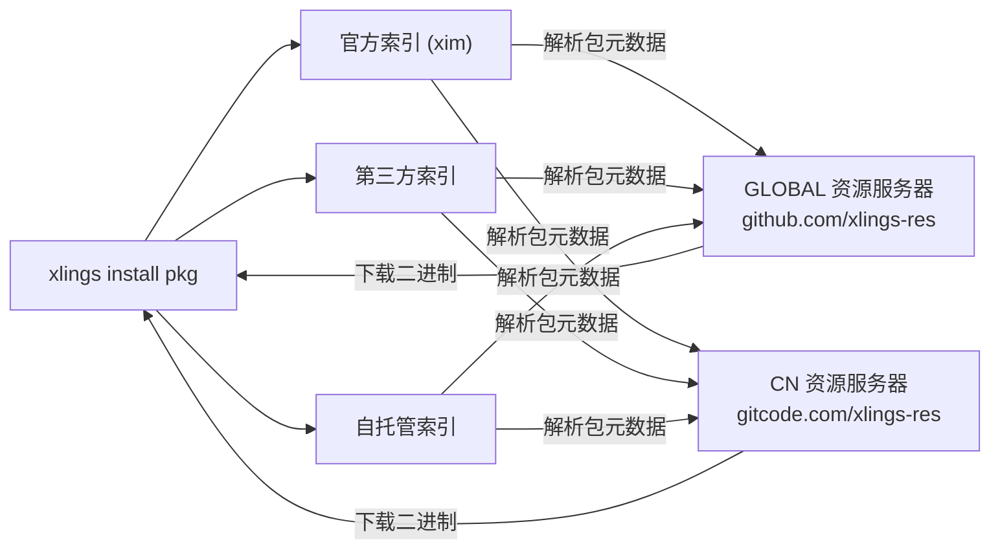

> 编写日期: 2026-05-17 | 版本: 0.4.36

# 包索引与自定义索引

## 索引生态概览

xlings 采用分层索引体系管理软件包元数据：

| 层级 | 说明 | 示例 |
|------|------|------|
| 官方索引 | openxlings/xim-pkgindex，默认内置 | `xim` |
| 第三方索引 | 社区或组织维护的公开仓库 | `community` |
| 自托管索引 | 本地路径或私有 Git 仓库 | `internal` |



## 添加自定义索引

编辑项目或全局 `.xlings.json`，在 `index_repos` 数组中追加条目：

```json
{
  "index_repos": [
    { "name": "xim", "url": "https://github.com/openxlings/xim-pkgindex.git" },
    { "name": "myteam", "url": "https://git.example.com/team/pkgindex.git" },
    { "name": "local-dev", "url": "/home/user/my-local-index" }
  ]
}
```

- `name` — 索引命名空间，用于包名前缀
- `url` — Git 远程地址，或本地路径（支持 `file:///` 前缀及相对路径）

添加后执行 `xlings update` 拉取索引数据。

## 资源服务器（二进制镜像）

资源服务器提供预编译包的下载加速。内置镜像：

| 名称 | 地址 | 适用区域 |
|------|------|----------|
| GLOBAL | github.com/xlings-res | 全球 |
| CN | gitcode.com/xlings-res | 中国大陆 |

xlings 按延迟自动选择最快的资源服务器。也可在 `.xlings.json` 中手动配置：

```json
{
  "resource_servers": [
    "https://github.com/xlings-res",
    "https://gitcode.com/xlings-res"
  ]
}
```

## 命名空间包

包名格式为 `<namespace>:<name>@<version>`：

```bash
xlings install subos:py-ds@1.0.0   # subos 索引中的 py-ds 包
xlings install myteam:tool@2.3.1   # 自定义索引中的包
xlings install gcc@14.2.0          # 默认 xim 索引（可省略命名空间）
```

省略命名空间时默认使用 `xim` 官方索引。

## 创建自己的索引仓库

索引仓库基本结构：

```
my-pkgindex/
├── packages/
│   ├── toolA/
│   │   └── xpkg.lua        # 包描述（版本、依赖、下载源）
│   └── toolB/
│       └── xpkg.lua
└── README.md
```

每个 `xpkg.lua` 声明包的版本列表、校验信息及安装逻辑。完成后将仓库推送到 Git 托管平台，其他用户即可通过 URL 引用。

## 常用命令

| 命令 | 作用 |
|------|------|
| `xlings update` | 刷新所有索引仓库（git fetch + reset） |
| `xlings search <pkg>` | 跨索引搜索包 |
| `xlings install <ns>:<pkg>@<ver>` | 安装指定命名空间的包 |
