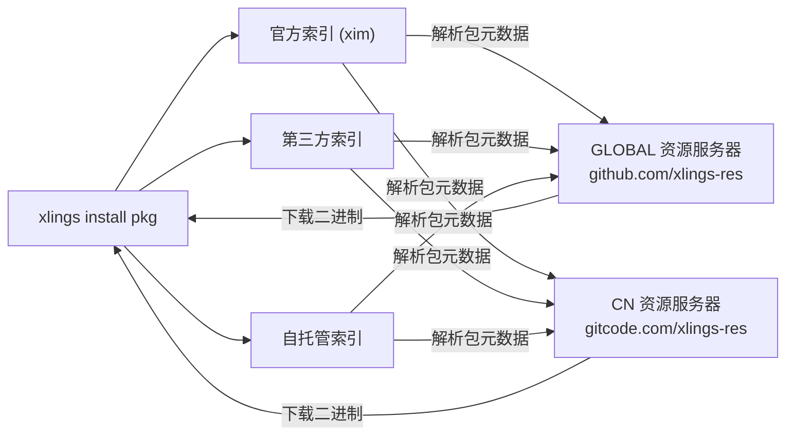

> 编写日期: 2026-05-17 | 版本: 0.4.36

# 包索引与自定义索引

## 索引生态概览

xlings 采用分层索引体系管理软件包元数据：

| 层级 | 说明 | 示例 |
|------|------|------|
| 官方索引 | openxlings/xim-pkgindex，默认内置 | `xim` |
| 第三方索引 | 社区或组织维护的公开仓库 | `community` |
| 自托管索引 | 本地路径或私有 Git 仓库 | `internal` |



## 添加自定义索引

编辑项目或全局 `.xlings.json`，在 `index_repos` 数组中追加条目：

```json
{
  "index_repos": [
    { "name": "xim", "url": "https://github.com/openxlings/xim-pkgindex.git" },
    { "name": "myteam", "url": "https://git.example.com/team/pkgindex.git" },
    { "name": "local-dev", "url": "/home/user/my-local-index" }
  ]
}
```

- `name` — 索引命名空间，用于包名前缀
- `url` — Git 远程地址，或本地路径（支持 `file:///` 前缀及相对路径）

添加后执行 `xlings update` 拉取索引数据。

> **数组里的条目是平级的，顺序不影响任何行为。** `name` 同时决定这个索引的目录、
> 命名空间，以及它下载哪一份索引 —— 三者同源，所以 `data/<name>` 只可能装
> `<name>` 自己的内容。
>
> 2026.8.30.1 之前不是这样:默认索引由**数组第 0 项**决定，而它下载的内容写死为
> 官方索引。于是把子索引写在首位（`xlings index use xim <ver>` 会把 `xim`
> 追加到数组末尾，从而无意造成这种排列），那个命名空间下就会凭空多出整个官方
> 索引，`xlings install <pkg>` 报“ambiguous”。升级后一次 `xlings update`
> 即可自愈:每个条目会被换成它自己的索引。

## 自定义索引的 artifact 加速（0.4.68+）

自定义索引默认走 git 同步。若索引发布方提供了 artifact（指针 + sha256 校验的
tarball，与官方索引同构），可在条目上声明 `artifact` 来源，获得与官方索引相同的
HTTP 下载健壮性（延迟重排 + 卡顿看门狗），git 自动降级为回退：

```json
{
  "index_repos": [
    {
      "name": "mcpplibs",
      "url": "https://github.com/mcpp-community/mcpp-index.git",
      "artifact": "https://github.com/xlings-res/mcpp-index",
      "source": "auto"
    }
  ]
}
```

- `artifact` — artifact 来源 base。字符串,或区域对象
  `{"GLOBAL": "...", "CN": "..."}`(按当前 mirror 解析、GLOBAL 兜底)。支持三类:
  GitHub/GitCode 仓库 URL(raw 指针 + release 资产)、任意静态 HTTP 目录、
  本地目录 / `file://`(目录内直接放指针与 tarball)。
- `source` — 该仓的传输模式(可省略,默认 `auto`):
  - `auto` — artifact 优先,失败回落 git;
  - `artifact` — 只走 artifact,失败即报错;
  - `git` — 强制 git,忽略 `artifact` 声明。

**发布方契约**(索引发布方需提供,mcpp-index 即为参照实现):

1. base 仓根部一个 raw 可取的 `<仓名>-pointers.json`,格式
   `{"format_version":1,"indexes":{"<key>":{<manifest>}}}`;
2. 每个版本一个 release,tag 为 `v<index_version>`,附 manifest 所写的 tarball;
3. tarball 根部含 `pkgs/`;
4. manifest 的 `artifact.sha256` 与资产一致。

指针里的 key 优先按条目 `name` 精确匹配;指针只有一个条目时直接采用
(发布方 key 与消费端命名空间不必一致)。

## 资源服务器（二进制镜像）

资源服务器提供预编译包的下载加速。内置镜像：

| 名称 | 地址 | 适用区域 |
|------|------|----------|
| GLOBAL | github.com/xlings-res | 全球 |
| CN | gitcode.com/xlings-res | 中国大陆 |

xlings 按延迟自动选择最快的资源服务器。也可在 `.xlings.json` 中手动配置：

```json
{
  "resource_servers": [
    "https://github.com/xlings-res",
    "https://gitcode.com/xlings-res"
  ]
}
```

## 命名空间包

包名格式为 `<namespace>:<name>@<version>`：

```bash
xlings install subos:py-ds@1.0.0   # subos 索引中的 py-ds 包
xlings install myteam:tool@2.3.1   # 自定义索引中的包
xlings install gcc@14.2.0          # 默认 xim 索引（可省略命名空间）
```

省略命名空间时默认使用 `xim` 官方索引。

## 创建自己的索引仓库

索引仓库基本结构：

```
my-pkgindex/
├── packages/
│   ├── toolA/
│   │   └── xpkg.lua        # 包描述（版本、依赖、下载源）
│   └── toolB/
│       └── xpkg.lua
└── README.md
```

每个 `xpkg.lua` 声明包的版本列表、校验信息及安装逻辑。完成后将仓库推送到 Git 托管平台，其他用户即可通过 URL 引用。

## 常用命令

| 命令 | 作用 |
|------|------|
| `xlings update` | 刷新所有索引仓库（git fetch + reset） |
| `xlings search <pkg>` | 跨索引搜索包 |
| `xlings install <ns>:<pkg>@<ver>` | 安装指定命名空间的包 |
