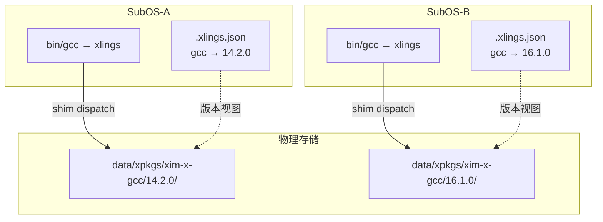

> 编写日期: 2026-05-17 | 更新: 2026-07-29 | 版本: 2026.7.29.0

# 多版本管理

xlings 支持同一工具的多个版本共存，并通过 shim 机制实现版本切换。不同 SubOS 环境可独立选择各自的活跃版本，物理存储通过引用计数共享。

## 基本操作

### 安装指定版本

```bash
xlings install gcc@14.2.0
xlings install gcc@16.1.0
```

多个版本并行安装，互不冲突。安装路径为：

```
~/.xlings/data/xpkgs/<namespace>-x-<package>/<version>/
```

例如 `xim-x-gcc/16.1.0/`、`local-x-mcpp/0.0.27/`。命名空间是包所属的索引仓库
（官方索引为 `xim`），它同时出现在目录名里和命令行坐标里 —— 见下面的"坐标写法"。

### 切换活跃版本

```bash
xlings use gcc 14.2.0
xlings use gcc@14.2.0     # 等价写法
```

切换后，当前环境中 `gcc` 命令即指向 14.2.0 版本。

如果一个包属于一个"发布组"（例如 gcc 同时提供 `gcc` / `g++` / `cpp`），
`use` 会整组一起切换，不会只切一个而让其余留在旧版本。

### 坐标写法：命名空间在最前面

带命名空间的包，完整坐标是 `<namespace>:<package>@<version>`：

```bash
xlings install local:mcpp@0.0.27
xlings install fromsource:freetype@2.13.2
```

注意顺序。版本数据库内部把命名空间记在版本号那一侧（`local:0.0.27`），
但命令行接受的是命名空间在最前面的形式。写成 `mcpp@local:0.0.27` 会被解析成
一个叫 `local:0.0.27` 的版本号，任何包都没有这个版本，命令必然失败。

`xlings use` 的版本参数则用数据库里的写法：

```bash
xlings use freetype fromsource:2.13.2
```

### 查看已安装包

```bash
xlings list
```

列出所有已安装的包及其版本信息。

## 工作原理

### Shim 机制

xlings 在 SubOS 的 `bin/` 目录中放置与工具同名的硬链接，指向 xlings 二进制本身。当用户执行 `gcc` 时，xlings 通过 argv[0] 识别调用目标，查询当前 workspace 中的活跃版本配置，将调用转发到对应版本的 xpkg payload。

### Version-View 与引用计数

多个 SubOS 环境共享同一份物理安装（位于 `~/.xlings/data/xpkgs/`），每个环境仅记录自己的"版本视图"。引用计数确保仅当最后一个使用者卸载时才删除物理文件。

### 架构图



## 与 SubOS 的交互

每个 SubOS 拥有独立的 workspace 配置文件（`.xlings.json`），记录该环境的活跃版本。这意味着：

- SubOS-A 中执行 `xlings use gcc@14.2.0` 不影响 SubOS-B 的版本选择
- 进入不同 SubOS 后，同一命令可能指向不同版本
- 物理安装仅保留一份，节省磁盘空间

## 示例流程

```bash
# 创建两个独立环境
xlings subos create dev-legacy
xlings subos create dev-latest

# 在 dev-legacy 中使用旧版本
xlings subos enter dev-legacy
xlings install gcc@14.2.0
xlings use gcc@14.2.0
gcc --version   # 14.2.0

# 在 dev-latest 中使用新版本
xlings subos enter dev-latest
xlings install gcc@16.1.0
xlings use gcc@16.1.0
gcc --version   # 16.1.0

# 两个环境互不干扰，物理存储共享
xlings list
```

## 注意事项

- 版本切换仅影响当前 SubOS 环境（或宿主环境）
- 卸载某版本时，若其他环境仍在引用，物理文件不会被删除
- 使用 `xlings list` 确认当前环境的活跃版本
