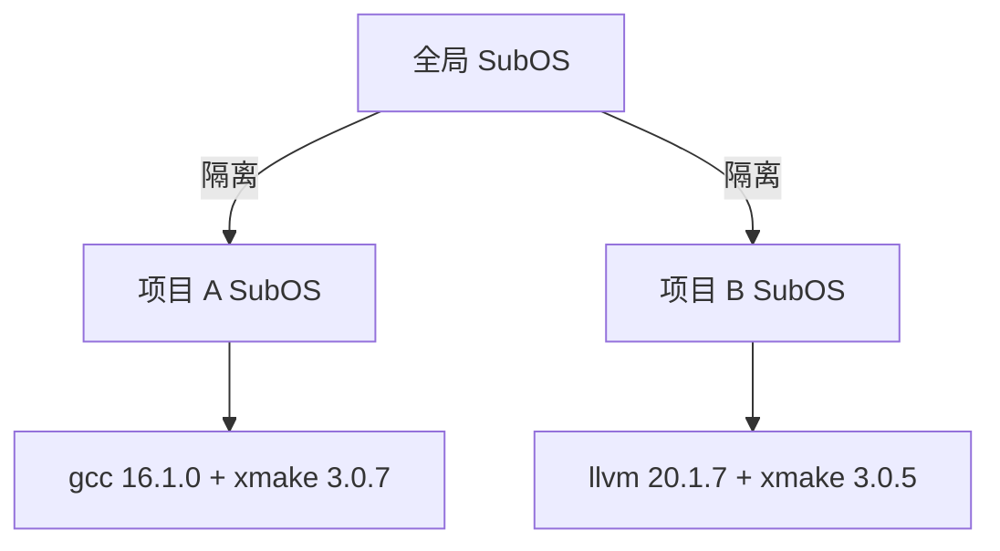

> 编写日期: 2026-05-17 | 版本: 0.4.36

# 项目级环境管理

xlings 支持以项目为单位的环境隔离。每个项目拥有独立的 SubOS，其中安装的工具链和依赖不会影响全局环境或其他项目。

## 核心概念



项目目录下存在 `.xlings.json` 即表示该目录为 xlings 项目根。进入该目录（或其子目录）时，xlings 自动检测配置并激活项目专属 SubOS，对用户完全透明。

## .xlings.json 格式

```json
{
  "workspace": {
    "xmake": "3.0.7",
    "gcc": {
      "linux": "16.1.0"
    },
    "llvm": {
      "macosx": "20.1.7",
      "windows": "19.1.0"
    }
  }
}
```

| 字段 | 说明 |
|------|------|
| `workspace` | 声明项目依赖及版本 |
| `"pkg": "ver"` | 全平台统一版本 |
| `"pkg": {"linux": "ver", ...}` | 按平台指定版本 |
| `subos` (可选) | 指定命名 SubOS，缺省时自动创建匿名 SubOS |

### 平台标识

- `linux` — Linux
- `macosx` — macOS
- `windows` — Windows

仅当前平台匹配的依赖会被安装，其余自动忽略。

## SubOS 模式

| 模式 | 配置方式 | 存储位置 |
|------|----------|----------|
| 匿名 | 缺省（无 `subos` 字段） | `.xlings/subos/_/` |
| 命名 | `"subos": "<name>"` | 全局 SubOS 池 |

匿名模式适合大多数场景；命名模式适用于多个项目共享同一环境的需求。

## 基本工作流

```bash
# 1. 在项目根目录创建 .xlings.json
cat > .xlings.json << 'EOF'
{
  "workspace": {
    "xmake": "3.0.7",
    "gcc": { "linux": "16.1.0" }
  }
}
EOF

# 2. 安装项目依赖
xlings install

# 3. 正常构建（工具链已就绪）
xmake build
```

当你 `cd` 进入项目目录时，xlings 自动完成以下步骤：

1. 检测 `.xlings.json`
2. 激活（或创建）项目 SubOS
3. 将项目 SubOS 中的工具注入当前 shell 路径

离开项目目录后，环境自动恢复为全局 SubOS。

## 与全局环境的关系


- 项目 SubOS 中的工具优先级高于全局
- 项目未声明的工具会回退到全局 SubOS
- 项目内通过 `xlings install` 安装的包仅对该项目可见
- 全局通过 `xlings install <pkg>` 安装的包对所有未覆盖的项目可见

## 常见场景

**多版本并行开发**：项目 A 使用 gcc 14，项目 B 使用 gcc 16，互不干扰。

**团队协作**：将 `.xlings.json` 纳入版本控制，团队成员 clone 后执行 `xlings install` 即可获得一致的开发环境。

**CI/CD**：在流水线中使用相同的 `.xlings.json`，确保构建环境与本地一致。
