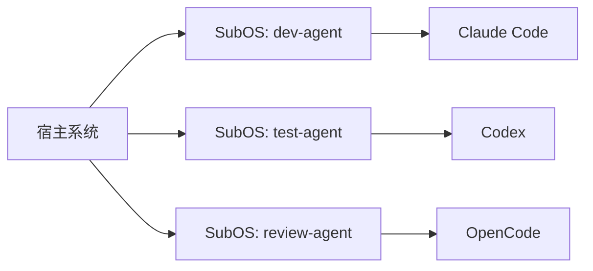
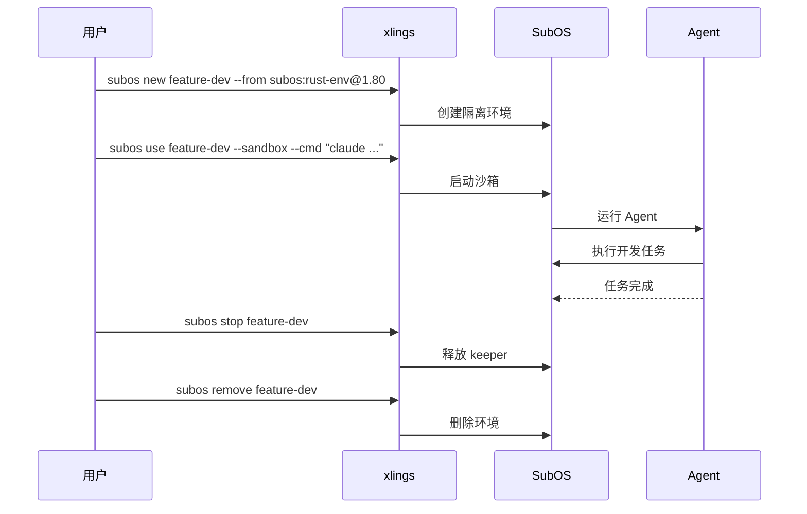

> 更新日期：2026-08-03

# SubOS 与 AI Agent 协作指南

Linux SubOS 可为 AI Agent 提供文件系统隔离。macOS 和 Windows 只重定向
用户目录，不隔离宿主文件系统或进程，因此不能用于运行不受信代码。

## SubOS 隔离级别

| 级别 | 说明 | 权限要求 | 适用场景 |
|------|------|----------|----------|
| shell | 环境切换，共享宿主文件系统 | 无 | 快速切换工具链版本 |
| FS | bwrap/proot 沙箱，独立文件系统视图 | 无需 root | Agent 日常开发、多实例隔离 |
| image | ext4 镜像挂载，完整系统环境 | 需要 root | 需要完整系统模拟的场景 |

## 创建 SubOS

基本创建：

```bash
xlings subos new dev-agent
```

从已有 xpkg 基础镜像创建（自动安装缺失的包）：

```bash
xlings subos new rust-agent --from subos:rust-env@1.80
```

指定存储模式：

```bash
# 共享存储（默认）
xlings subos new my-agent --storage shared

# 临时存储（会话结束后清除）
xlings subos new tmp-agent --storage tmpfs

# 镜像存储（持久化 ext4）
xlings subos new full-agent --storage image
```

## 在 SubOS 中运行 Agent

核心用法：Agent 运行在 SubOS 内部，通过沙箱获得隔离。

```bash
# 进入 SubOS 并启动 agent
xlings subos use dev-agent --sandbox
# 进入后运行你的 agent 工具
claude
# 或
codex
```

直接执行命令：

```bash
xlings subos use dev-agent --sandbox --cmd "claude --task 'fix lint errors'"
```



## 多 Agent 实例并行

同一台主机上运行多个独立的 Agent 实例，互不干扰：

```bash
# 创建多个 SubOS
xlings subos new agent-frontend --from subos:node-env@22
xlings subos new agent-backend --from subos:rust-env@1.80
xlings subos new agent-infra --from subos:python-env@3.12

# 分别启动（各终端窗口中执行）
xlings subos use agent-frontend --sandbox --cmd "claude --task 'implement UI components'"
xlings subos use agent-backend --sandbox --cmd "claude --task 'add API endpoints'"
xlings subos use agent-infra --sandbox --cmd "codex --task 'write terraform modules'"
```

Linux sandbox 模式提供独立文件系统视图；macOS/Windows 只分离配置目录。

## 临时任务（一次性执行）

使用 `--storage tmpfs` 创建一次性环境，会话结束后数据自动清除：

```bash
# 创建临时环境执行单次任务
xlings subos new ephemeral --storage tmpfs
xlings subos use ephemeral --sandbox --cmd "claude --task 'audit this repo for security issues'"

# 任务完成后清理
xlings subos remove ephemeral
```

适合代码审查、安全扫描、实验性修改等不需要保留结果的场景。

## xlings interface（程序化控制）

`xlings interface` 提供 NDJSON 协议，支持外部程序以结构化方式控制 SubOS 生命周期：

```bash
# 能力发现
xlings interface --list

# 每次调用在命令行指定 capability 和 JSON 参数
xlings interface create_subos --args '{"name":"ci-agent"}'
xlings interface list_subos --args '{}'
xlings interface remove_subos --args '{"name":"ci-agent"}'
```

stdin 只传递 `cancel`、`pause`、`resume` 和 `prompt-reply` 等运行时控制
消息，不用于选择 capability。

可用于 CI/CD 集成或自定义编排工具。

## 完整工作流示例

以下演示从创建环境到任务完成的完整流程：

```bash
# 1. 创建基于 Rust 工具链的 SubOS
xlings subos new feature-dev --from subos:rust-env@1.80 --storage shared

# 2. 在沙箱中启动 Agent 完成开发任务
xlings subos use feature-dev --sandbox --cmd "claude --task 'implement the caching layer in src/cache/'"

# 3. 进入环境检查结果
xlings subos use feature-dev --sandbox
cargo test
cargo clippy
exit

# 4. 确认无误后，释放 keeper 进程
xlings subos stop feature-dev

# 5. 不再需要时删除环境
xlings subos remove feature-dev
```



## 常用命令速查

| 命令 | 说明 |
|------|------|
| `xlings subos new <name>` | 创建 SubOS |
| `xlings subos use <name> --sandbox` | 进入沙箱环境 |
| `xlings subos use <name> --cmd "..."` | 在 SubOS 中执行命令 |
| `xlings subos stop <name>` | 释放 keeper 进程 |
| `xlings subos remove <name>` | 删除 SubOS |
| `xlings interface` | 启动 NDJSON 程序化接口 |
